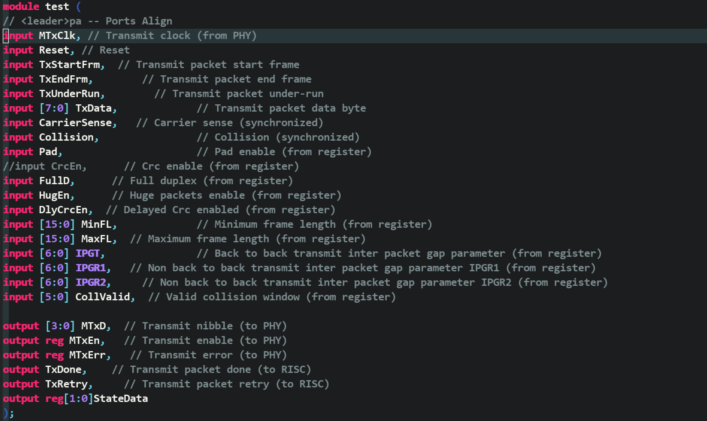
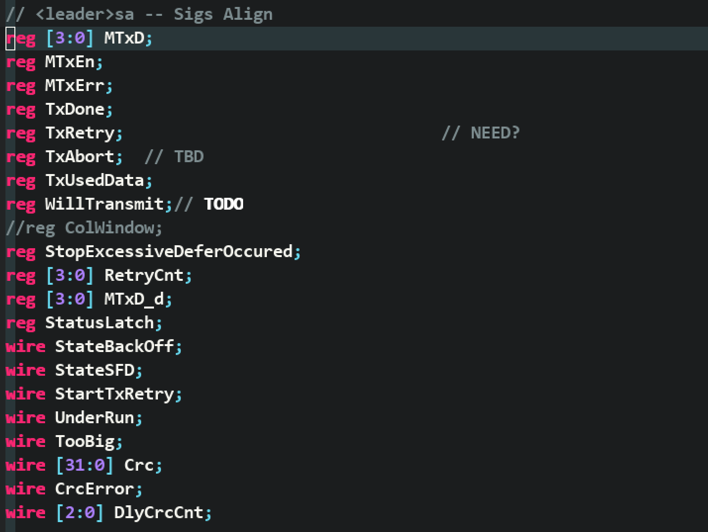
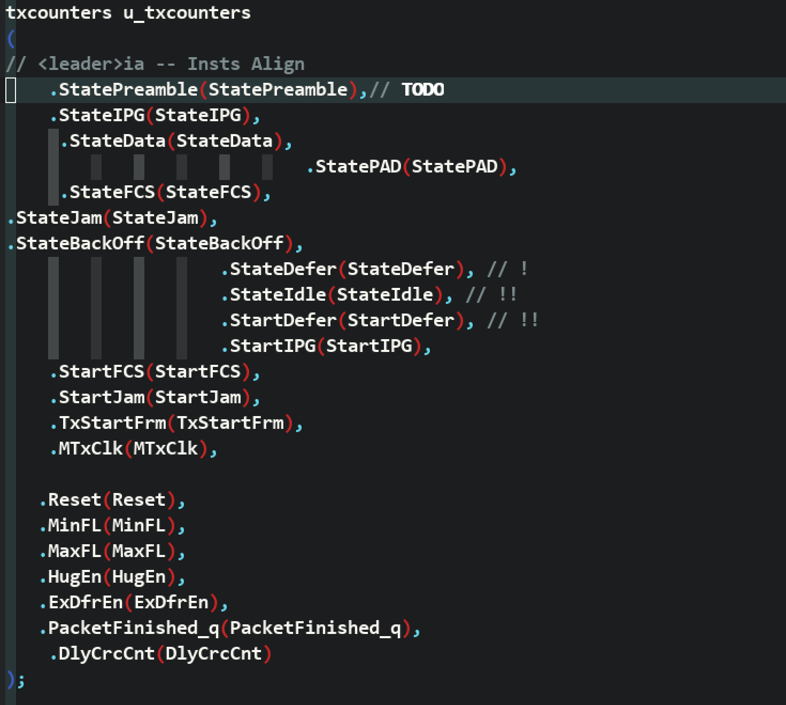

# verilog_align

This is a tool to align Verilog code.


## 用法

### vundle

Plugin ‘CannedGrape/verilog_align’


### 改变快捷键

```vim
vnoremap <silent> <leader>pa :<C-U>call AlignPortsFunction(visualmode(), 1)<CR>
vnoremap <silent> <leader>sa :<C-U>call AlignSigsFunction(visualmode(), 1)<CR>
vnoremap <silent> <leader>ia :<C-U>call AlignInstsFunction(visualmode(), 1)<CR>
```


## 示例









